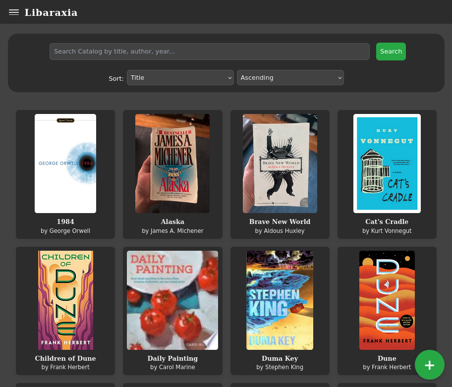
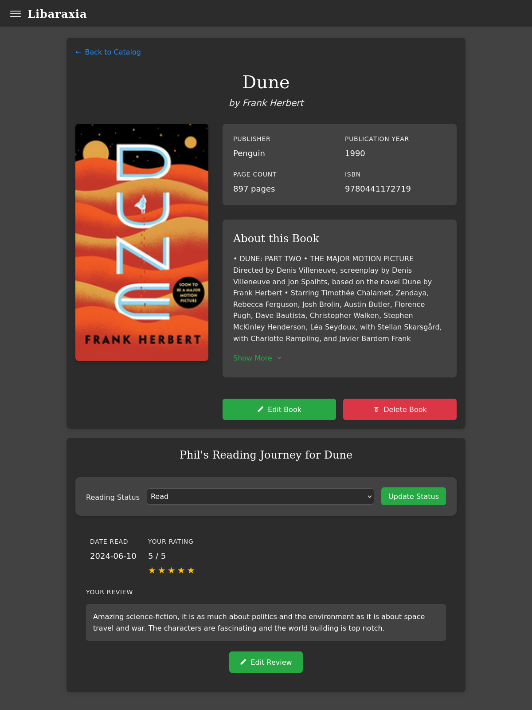
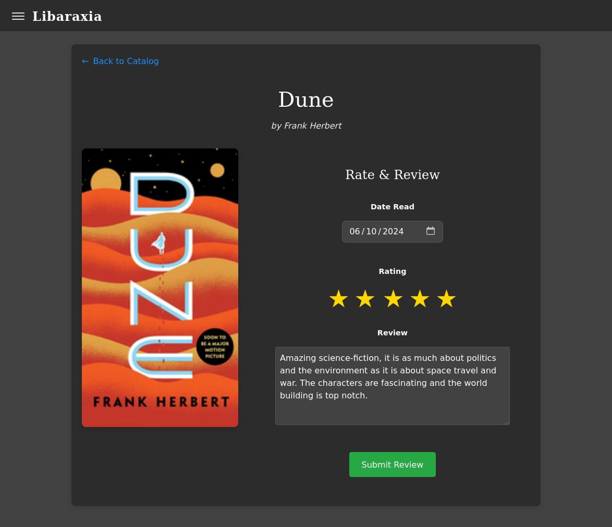

# Libaraxia








# 📚 Project Overview

Libaraxia is a modern web application designed to help you catalog and manage your personal library with style and efficiency. Built with Flask and SQLite, it offers a seamless interface for organizing your book collection, tracking your reading progress, and maintaining your literary life. What started as a hobbyist project has evolved into a feature-rich library management system. While it's still growing and improving, it's already a robust solution for personal library organization.

## 🛠️ Installation 

Currently, Libaraxia is in active development, not stable, and not recommended for production use. However, if you're feeling adventurous and want to help beta test these instructions should in theory work:

1. git clone the repository 

```shell
git clone https://github.com/philcifone/libaraxia
```

2. Install required packages with the requirements.txt

```shell
pip install -r requirements.txt
```

3. To initialize SQLite database with the provided create_database.sql file run the following command:

```shell
sqlite3 your_database.db < create_database.sql
``` 

4. Configure your environment variables:

```shell
### EXAMPLE ###

SECRET_KEY=your_secret_key

DATABASE_URI=sqlite:///library.db

FLASK_APP=app:create_app

GOOGLE_BOOKS_API_KEY=get_yours_at_https://console.cloud.google.com
```

5. Run in project root with flask/gunicorn/python, whichever. python3 is easiest for development server:

```shell
python3 app.py
```


### ✨ Features

- Tiled library view
- Add/edit/delete book
- ISBN fetch auto fill
- Book title and author search & autofill
- Catalog search
- Catalog sort
- Catalog filter
- User cover upload
- Account register (admin only)
- Multi-user login & authentication
- Email and Password update
- Library & user stats
- csv export
- Custom book tags per user
- Custom collections per user
- Rating & comment system per user

### 🚧 Future Feature Ideas

- Barcode scanner - still in development
- Admin & user settings
- Library Activity Feed
- Docker packaging for self

### 💡 Contributing 

Found a bug? Have a feature idea? Contributions are welcome! While this started as a personal project, I believe in the power of community-driven development, and I am not a trained developer. This has been the product of a lot of AI collaboration, and I'd love for experienced human eyes to check this out. ***PLEASE*** feel free to: 

- Open issues for bugs or feature requests 
- Submit pull requests (I've never made it this far with github so bear with me as I learn to do more than commit/push/pull)
- Share your ideas and feedback 
- Help with documentation

### 📝 To Do:

- [x] Backup project files!!
- [x] Have fun!!!!!
#### Frontend
- [x] Fix tile text alignment
- [x] Add Author to tile
- [x] Add better back to list on search page inside search container
- [x] Fix add book button
- [x] Style main page search bar add sort
- [x] Heading on Add Book page
- [x] Update book details style to match
- [x] Hamburger menu and side bar
- [x] Add book floating button
- [x] View more button for description 
- [x] Fix collections toolbar (show read state)
- [x] Added tailwind css
- [x] Better search bar functionality
- [x] Better back to catalog button
- [x] Refactor styles.css
- [x] Make add & edit book pages prettier!!
- [ ] Better fonts
- [x] better mobile on book details page
- [ ] Side scroll of books on collections page
- [ ] separate recent books/reviews feed/list?
- [x] Test Docker packaging
- [ ] Release docker packaging

#### Backend
- [x] Fetch book descriptions
- [x] Multi-user creation & login authentication
- [x] Sort catalog feature
- [x] Admin only access to CRUD functions
- [x] Search function
- [x] Version Control
- [x] Fix image upload in add_image route
- [x] Image resize/optimize during upload
- [x] Refactor code, add blueprints
- [x] secret key to server/dev env instead of codebase
- [x] Remove books table read column (will be a future user table column)
- [x] Add rating & comments
- [x] Improve & fix bookshelves (collections, now reading lists)
- [x] auto image download
- [x] Cover image fetch script/button (auto fetch during add but user can replace in add and edit) - revisit
- [x] User book details
- [x] User profile
- [x] Add "DNF" section to reading status & list
- [x] Genre & subtitle add to API fetch & book details
- [x] Filter options!!! (year read, year published, page count, genre, is_read, etc.)
- [x] Export to spreadsheet/csv
- [x] User created bookshelves/collections
- [ ] Admin & user settings

### 📅 2024-12-30

#### Updated a lot of frontend
 - tailwind css - added but not used
 - vanishing header bar
 - hamburger menu and sidebar
 - moved "collections" to "user profile", switching name to "reading list"
 - need to create ability for users to create their own collections for collections page

### 📅 2025-01-01
#### Switched to Claude AI for troubleshooting, more frontend updates, some backend
- Better refactoring of blueprints.books.py to utils.book_utils.py
- Fixed cover fetch
- Layouts for book details and rate & review are much cleaner and polished
- More symbols/icons in use for UX/UI
- Better sidebar features
- User profile password and email update

### 📅 2025-01-05 

#### Lots of search and filtering advancements today, plus csv export

- Implemented title/author search functionality 
- Added CSV library & user info export
- Enhanced book addition with auto-fill  
- Improved cover image fetching and quality 
- Refined UI/UX with smoother transitions 
- Added reading statistics dashboard 
- Enhanced filter and sort capabilities 
- Implemented tag management system
- Created custom collections
- Started barcode scanner feature

### 📅 2025-01-22 

#### Been awhile since I updated after starting other projects. I started to rebuild this in React but realized it would be easier to simply add tailwindcss since the backend seems to function quite well here.
 - Updated tailwindcss for:
   - search/sort/filter
   - sidebar
   - add book
   - book details
   - index
- Added google books api key to book utils and books route - unsure if working!

needs addressed:
- better mobile style on book details - centered
- api title search and display on add book, need to test! - javascript??
- search bar inside top navbar, sort/filter dropdown.
  - sort reset button instead of on change?
- untracked read status not resetting? others work, low priority

#### Finished with changing all the templates to tailwind css and fixed the  api!
- Commited and pulled from repo to prod server and works!
- Tried updating search/navbar/sidebar into something more modern but couldn't get it.
- almost forgot to add the google api key :)

### 📅 2025-01-23
#### Images werent being added from the title/author search selection
 - mostly fixed after excruciating debugging.
 - Author and genre info are not fetching from the json data, see console, utils, and books.py.
 - see diff between old and new add_books.js, and old scripts.js (comment: populate data, fillBookForm)??
 - need to add "selected" javascript to button once the book data is fetched and populated below
 - need to add "no-cover.png" to prod server, or just do text placement. JavaScript goes brrrrr looking for it if it isn't there.
- WOOHOO fixed the search, cover fetch, and info fetch. Updated styles, working on fonts. Cant quite get it.
   


--- 
Built with ☕ and 🥃 by a 📖 lover, for 📚 lovers.