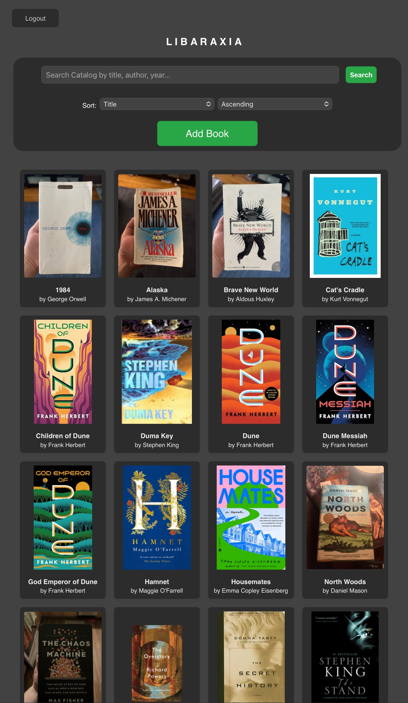
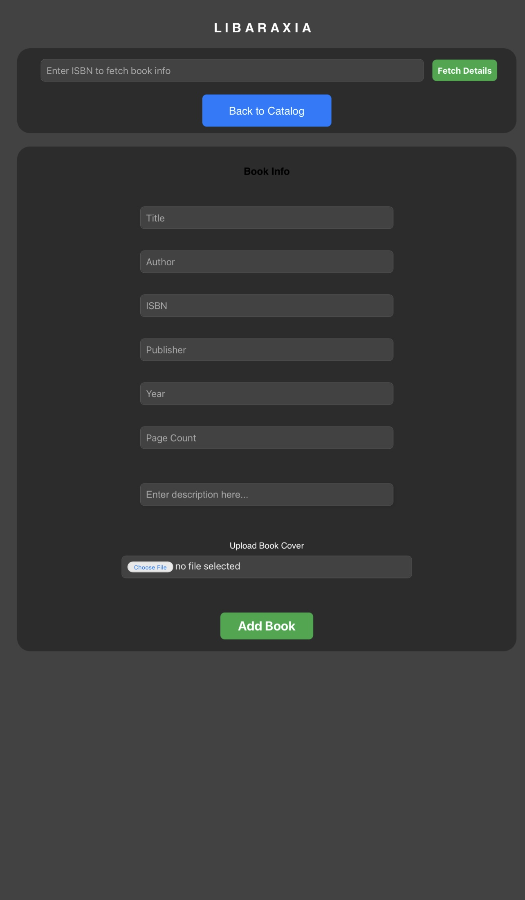
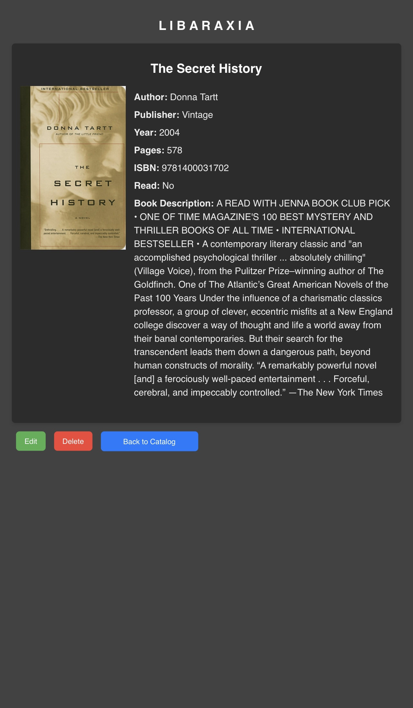

# Libaraxia

# Project scope:

A self hosted personal library catalog. Accessible via web app to easily list, add, edit, and delete books from one's personal collection. Frontend in HTML and CSS and backend is SQLite and Flask (python). 

This is a beginner project I'm developing to achieve the goal of cataloging my personal library. It is a basic CRUD application, that sports a few additional features right now, although I'm still adding and testing more. I'm not much of a developer, and I am learning as I go. It is a bit of a hobby project I'm trying to to take seriously. Thus, if you find this interesting or useful and want to offer feedback I will happily listen!

## Usage & Installation

Anyone stumbling across this is absolutely welcome to use or fork this under the GPL license I guess? I strongly recommend against it in it's current form. While I am currently handling much of the security concerns I had, I am still learning and do not feel comfortable deploying it as any sort of full fledged self hosted application for public use just yet.

I guess all you would need to do is setup the users and books tables in a sqlite3 library.db and downloading all the flask packages but that's on you.

### Known Issues
I'm learning how to clean up the HTML and CSS, so bear with me. I'm working on [[#Future Refactoring]] for flask blueprints as well. 

### Existing features:
- Tiled homepage
- Add book
- Edit entry
- Delete entry
- ISBN lookup
- Search
- Cover upload
- Catalog sort
- Account register
- Multi-user login & authentication

### Future features:
- Rating system
- Comment system
- User filter
- Custom shelf collections
- Share shelf
- Barcode scanner
- Better mobile UI
- React
- Tailwind css

### To Do:

- [ ] Backup project files!!
- [ ] Have fun!!!!!!
#### Frontend
- [x] Fix tile text alignment
- [x] Add Author to tile
- [x] Add better back to list on search page inside search container
- [x] Fix add book button
- [x] Style main page search bar add sort
- [x] Make add & edit book pages prettier
- [ ] Make book details page prettier
- [x] Update book details style to match
- [ ] Light & dark mode toggle (tailwind css?)

#### Backend
- [x] Search function
- [x] Version Control
- [x] Fix image upload in add_image route
- [ ] Image resize/optimize during upload
- [ ] Cover image fetch script/button (auto fetch during add but user can replace in add and edit) - revisit
- [ ] Genre & subtitle add to book details
- [x] Remove read status (will be a future user feature)
- [x] Fetch book descriptions
- [x] Multi-user creation & login authentication
- [ ] User "bookshelves" (collections)
- [x] Sort catalog feature
- [x] Admin only access to CRUD functions
- [ ] Admin dashboard

### Future Planning:

#### Tables Layout

1. Users

    user_id (Primary Key)
    username
    password_hash
    email
    is_admin (Boolean, for admin tools)

2. User Collections

    collection_id (Primary Key)
    user_id (Foreign Key to Users)
    book_id (Foreign Key to Books)
    status (Enum: 'read', 'want to read', 'currently reading')

3. Read Data

    read_data_id (Primary Key)
    user_id (Foreign Key to Users)
    book_id (Foreign Key to Books)
    date_read
    rating
    comment

#### Future Refactoring

libaraxia/
├── app.py                    # The main entry point for your app
├── config.py                 # App configuration (e.g., secret keys, database URI)
├── instance/                 # Contains your SQLite database
│   └── library.db
├── libaraxia/                # Application package
│   ├── __init__.py           # Initializes the app and extensions
│   ├── routes/               # Directory for blueprints
│   │   ├── __init__.py       # Registers blueprints
│   │   ├── main.py           # Core app routes (homepage, index, etc.)
│   │   ├── admin.py          # Admin tools routes
│   │   └── user.py           # User-specific features routes
│   ├── models.py             # Database models
│   ├── services.py           # Business logic functions
│   └── utils.py              # Helper functions (e.g., format dates)
├── static/
│   ├── css/
│   │   └── styles.css        # Your stylesheet (break into smaller files if needed)
│   ├── js/
│   │   └── scripts.js        # JavaScript for interactivity
│   └── images/
│       └── logo.png          # Static images
├── templates/
│   ├── base.html             # Base template
│   ├── home.html             # Home page template
│   └── admin/
│       ├── dashboard.html    # Admin dashboard template
│       └── tools.html        # Admin tools template
└── README.md                 # Project documentation